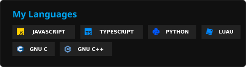

<h1 align="center">About me</h1>

Hi there! My name is Bogdan. I'm a hobbyist software engineer, primarily using **Python** and **C/C++**.

<h1 align="center">Languages</h1>

<h1 align="center">Collaborating</h1>

As long as your project is in a language I'm familiar with, is open-source, is within the domains I'm comfortable working in, and I have enough time, I'm up for collaboration.

<h1 align="center">Contributions</h1>

<h2 align="center"><a href="https://github.com/mltframework/shotcut">MLT Framework, Shotcut</a></h2>

1. Removed use of deprecated functions

<h2 align="center"><a href="https://github.com/NotValra/RoValra">NotValra, RoValra</a></h2>

1. Added a translator badge
0. Added issue templates
0. Added hashmap to disk-based cache to reduce disk access
0. Wrote minimal markdown parser for untrusted text
0. Added a setting to reduce roblox plus advertising
0. Added a unified settings API
0. Added a custom theme switching feature
0. Fixed overflow issue in "Custom Age Theme Badge Text" feature

1. Implemented unofficial JSDoc-based documentation ([Github-Pages/bogdan-glitchm/RoValra](https://bogdan-glitchm.github.io/RoValra)) 

<h1 align="center">Other Links</h1>

* **Reddit account:** [Reddit/Player123456789_10](https://www.reddit.com/user/Player123456789_10/)
* **Discord account:** [Discord/the_glitch_master](https://discord.com/users/808381764623532102)
* **Twitter account:** [Twitter/xBogdan0](https://x.com/xBogdan0)
* **Personal C++ Styleguide:** [Github-Pages/Bogdan-glitchm/CPP-Styleguide](https://bogdan-glitchm.github.io/CPP-Styleguide/)
* **Personal Python Styleguide:** [Github-Pages/General-software-development/PySR](https://general-software-development.github.io/PySR/)
* **My Projects:** [GitHub/General Software Development](https://github.com/general-software-development)

  

More Info: gh user id 34373732
